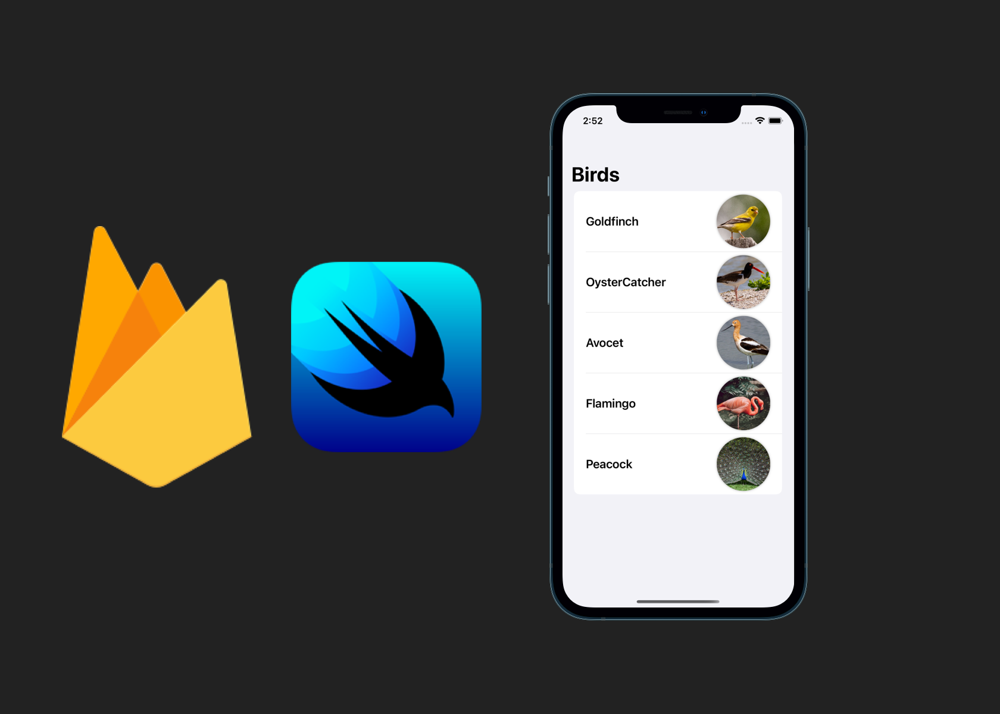

# Bird

### A SwiftUI List fetching JSON data from Firebase Realtime Database using MVVM architecture

How to make it works:

- Create a new iOS project on the Firebase console.
- Add your own GoogleService-Info.plist to the target.
- Set up Firebase Realtime Database to receive data.
- Import the bird.json file (you will find it in the folder) in Realtime Database > import JSON.
- Run the Applciation (SPM should fetch the packages itself).

## Screenshots of the Application:

